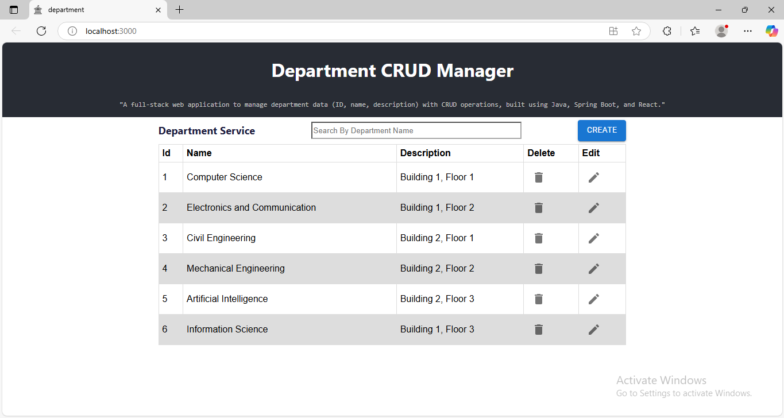

# JavaFullStackDepartmentCRUD


## Project Overview

This project is a full-stack web application that allows users to perform **CRUD** (Create, Read, Update, Delete) operations on **Department** data. The project is built with a **Java Spring Boot** backend (for the CRUD logic) and a **React** frontend (for the user interface). It is designed to handle a department management system where you can add, view, update, and delete department records.
Additionally, this project includes **comprehensive unit testing** using **JUnit 5 and Mockito**, achieving **98% test coverage** across the entire application.

---

## Features

- **Create**: Add new departments to the system.
- **Read**: View the list of departments stored in the system.
- **Update**: Modify existing department details.
- **Delete**: Remove a department from the system.
- **Search**: Search departments by name.

---

## Tech Stack

- **Frontend**: 
  - React.js
  - fetch (for making HTTP requests)
  - Material UI
  - CSS for styling 
  
- **Backend**: 
  - Java
  - Spring Boot
  - Spring Data JPA (for database interaction)
  - Spring Boot REST API (for communication between frontend and backend)
  - JUnit & Mockito (for unit testing)
  
- **Database**: 
  - MySQL Database (or you can use H2/PostgreSQL depending on your setup)

---

## Testing Highlights
  - Unit tests for Controller, Service, and Repository layers.
  - Mocking with Mockito for efficient test execution.
  - Use of MockMvc for testing REST API endpoints.
  - H2 in-memory database for repository testing.
    
---

## Prerequisites

Before you begin, ensure you have met the following requirements:

- Java Development Kit (JDK) 17 or higher
- Maven (for backend dependency management)
- Node.js and npm (for frontend dependencies)
- A MySQL (for database)
- IDE (e.g., IntelliJ IDEA, VS Code)

---
## Setup and Installation

### 1. Clone the Repository

```bash
git clone https://github.com/vinayak-s-b/JavaFullStackDepartmentCRUD.git

cd JavaFullStackDepartmentCRUD
```
### 2. Backend (Spring Boot Application)
```bash
cd DepartmentService

mvn clean install

//set up database ( MySQL/H2/PostgreSQL)
mvn spring-boot:run
```
### 3. Frontend (React Application)
``` bash
cd dept_service

npm install

npm start
```
After setting up both the DepartmentService(Backend) and dept_service(frontend), you can test the application at the following URLs:

- DepartmentService: http://localhost:9003/departments/
- dept_service: http://localhost:3000

The React frontend will interact with the Spring Boot backend via API calls to display and manage departments.

---
Below is an image demonstrating the project:




